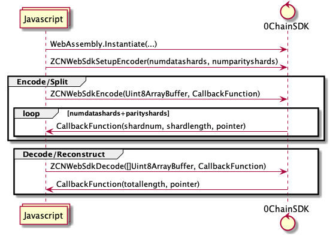

# WebSDK as WebAssembly(WASM)

## Table of Contents
- [Building WASM](#build)
- [SDK Usage](#sdk-usage)
---
## Building WASM
Run below comand and all the required binaries, js and index.html will be in **0chainwebsdk** folder
```
make sdk
```
---
## SDK Usage
